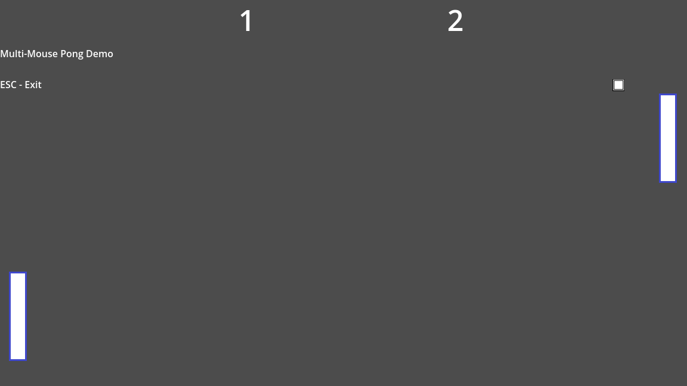
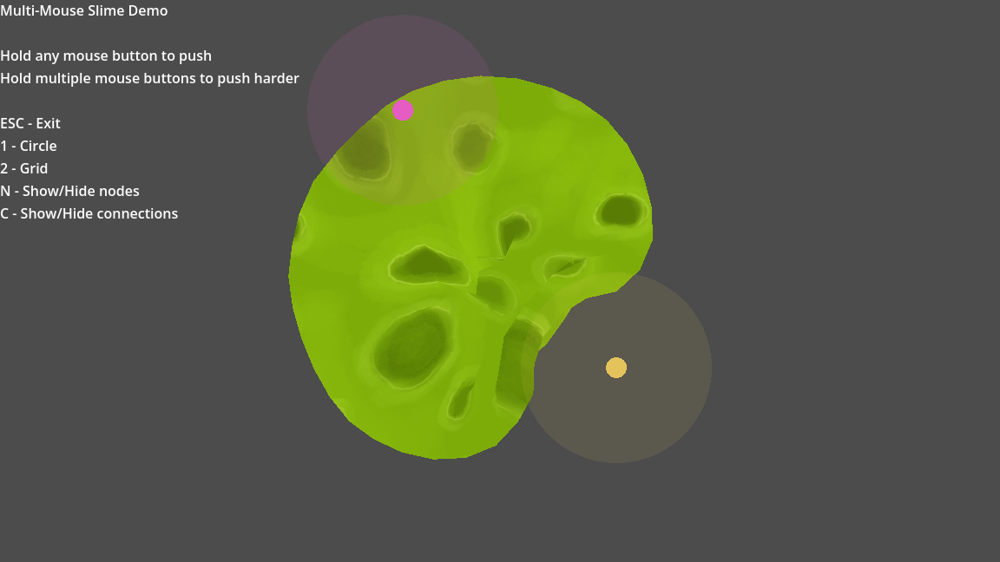

# Multi-Mouse

Multi-Mouse is a Godot 4 add-on that delivers raw per-device mouse input. Plug in
multiple USB mice and each one gets its own motion stream, button events, and
metadata so your game can treat every physical mouse as a unique player or tool.

**Project home:** https://github.com/duan-c/Multi-Mouse

> The Windows Raw Input backend is working end-to-end
> (see the demos below). Linux support is still on the roadmap, so expect
> Windows-only binaries for now.

## Highlights

- **Node-based workflow** – the `MultiMouse` node can be dropped into any scene.
  Call `attach_to_window()` + `enable()` and you immediately start receiving
  `motion`, `button`, `device_connected`, and `device_disconnected` signals.
- **Godot-friendly events** – the native extension emits standard
  `InputEventMouseMotion` / `InputEventMouseButton` objects that already contain
  `device`, `device_guid`, and raw deltas.
- **Reference demos** – the Simple motion logger, the two-mouse Pong scene,
  and the fully interactive Slime toy showcase how to use the node in real projects.

## Repository layout

```
Multi-Mouse/
├─ addons/multi_mouse/    # Godot plugin + MultiMouse node
├─ demo/                  # Simple + Slime demo projects
├─ scripts/               # Build helpers (Windows + Linux)
├─ src/                   # GDExtension/native backend
└─ extern/godot-cpp/      # Submodule required for builds
```

## Quick start (Windows)

1. Clone the repo and fetch submodules:
   ```bash
   git clone https://github.com/duan-c/Multi-Mouse.git
   cd Multi-Mouse
   git submodule update --init --recursive
   ```
2. Build the extension DLL via PowerShell:
   ```powershell
   pwsh ./scripts/build_windows.ps1 -Target template_debug
   ```
   This compiles `godot-cpp`, builds the native extension, and drops the DLL
   into `addons/multi_mouse/bin/win64/`.
3. Open `demo/project.godot` (or your own project), enable the plugin under
   **Project → Project Settings → Plugins**, and add a `MultiMouse` node to the
   scene where you want raw input.
4. In that scene’s script, wire it up:
   ```gdscript
   @onready var multi_mouse: MultiMouse = $MultiMouse

   func _ready():
       multi_mouse.attach_to_window(0) # bind to the main window
       multi_mouse.enable()
       multi_mouse.motion.connect(_on_motion)

   func _on_motion(event: InputEventMouseMotion) -> void:
       print("Mouse", event.device, "moved", event.relative)
   ```

## Quick start (Linux)

Dependencies: `cmake`, `ninja` or GNU Make, `scons`, a C/C++ toolchain, and the X11 + Xi development headers. On Ubuntu/Debian:

```bash
sudo apt install build-essential python3-pip scons cmake libx11-dev libxi-dev
```

1. Clone the repo and submodules (same as Windows).
2. Build the debug `godot-cpp` and native library:
   ```bash
   ./scripts/build_linux.sh
   ```
3. Build the release variant:
   ```bash
   TARGET=template_release ./scripts/build_linux.sh
   ```
   Each run drops `libmulti_mouse.linux.<target>.x86_64.so` into `addons/multi_mouse/bin/linux/` so the add-on can consume it immediately.
4. Open `demo/project.godot`, enable the plugin, and run any of the scenes.

### Runtime notes (Linux)

- The backend uses [ManyMouse](https://github.com/icculus/manymouse) (zlib license). By default it tries the XInput2 driver so normal users don’t need `/dev/input` access.
- To force the evdev backend (one device per `/dev/input/event*` node), export `MANYMOUSE_NO_XINPUT2=1` before launching Godot. You’ll need read access to `/dev/input/event*` (run Godot as root, add yourself to the `input` group, or drop in a udev rule).
- Some VMs expose a single virtual pointer that XInput2 splits into “motion” and “button” slaves. If you see clicks coming from a different device ID, switch to the evdev backend as described above. On real hardware with two USB mice you’ll get one device ID per physical mouse.

## Demos

Both demos live inside `demo/project.godot` and have their own README files.

- **Simple demo** (`demo/simple`)
  - Shows the bare-minimum integration: attach the node, print motion/button
    events, quit with `Esc`.
  
- **Pong demo** (`demo/pong`)
  - Local multiplayer built entirely with Multi-Mouse input. The first mouse to
    left-click claims the left paddle, the first right-click claims the right
    paddle, and both players can rally immediately. `Esc` exits.
  
- **Slime demo** (`demo/slime`)
  - A physics net you can poke with one or many mice. Press `1` for a radial
    mesh, `2` for a grid, `C` to toggle springs/connections, and `N` to toggle
    the node overlay. Holding multiple buttons lets you “push harder”, and the
    `mesh_texture` export makes it easy to drop in any tileable membrane art.
  

> Default slime membrane texture: “Handpainted tileable textures 512×512 – ooz_slime.png” by DeadKir (CC0) via OpenGameArt.

## Building

- **Windows** – use `scripts/build_windows.ps1`. It runs SCons for `godot-cpp`,
  configures CMake, and copies the resulting `multi_mouse.dll` into the plugin.
- **Linux** – `scripts/build_linux.sh` contains the equivalent flow, but the
  backend is still stubbed. Only build here if you are hacking on the future
  Linux support.

## Roadmap

- ✅ Windows Raw Input backend with hotplug + per-device events
- ✅ Drop-in `MultiMouse` node (no global autoload requirement)
- ✅ Simple + Slime demo updates
- 🔄 Better diagnostics UI and asset-library packaging
- 🔜 Linux backend (ManyMouse/libinput) and macOS support

## License

MIT
