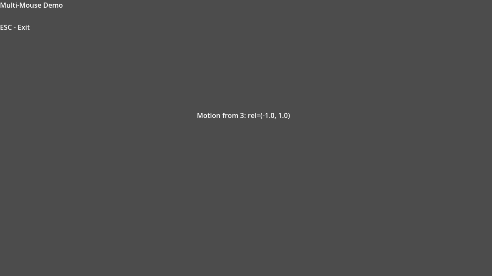

# Simple Multi-Mouse Demo

A minimal scene (`demo/simple/demo.tscn`) that proves the native backend is
running. It prints motion/button events from every connected mouse so you can
verify device IDs before integrating into your game.

## Controls

- `Esc` – exit the demo.
- Move or click any hardware mouse – the label updates with the device ID and
  delta/button state.

## Running the scene

1. Open `demo/project.godot` in Godot 4.
2. Enable the **Multi-Mouse** plugin if it is not already active.
3. Run the `Simple` scene (`demo/simple/demo.tscn`). The overlay immediately lists every
   device that reports motion/button input.

## How it works

`demo.gd` looks for a `MultiMouse` node in the scene, attaches it to the window,
and connects to the `motion`/`button`/`device_disconnected` signals. Everything
else is plain Godot UI, so you can copy/paste the script into your own project
as a quick diagnostic overlay.
